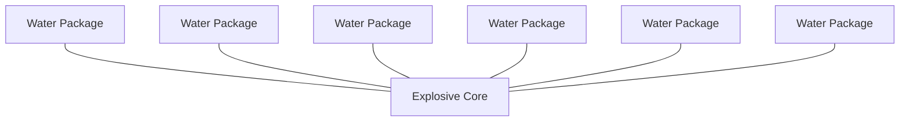

# Explosive Energy Mitigation with Water Packages

This document outlines the principles, formulas, and best practices for using water packages to mitigate explosive energy effectively. It includes theoretical explanations, practical guidelines for alignment, and visualization techniques.

---

## **Overview**
Explosions release energy in the form of heat, shockwaves, and mechanical destruction. Water can act as an effective energy absorber, reducing the impact of explosions through thermal and mechanical energy absorption mechanisms.

### **Key Mechanisms**
1. **Thermal Absorption:** Water absorbs heat until it boils, then vaporizes, consuming additional energy through its latent heat of vaporization.
2. **Shockwave Damping:** Water packages act as barriers, dispersing shockwaves and reducing their intensity.

---

## **Formulas**

The energy absorbed by water ($Q$) is calculated as:

$Q_{water} = m_w \cdot c_w \cdot (\Delta T) + m_w \cdot L_v + m_v \cdot c_v \cdot (\Delta T_{vapor})$

Where:
- $m_w$: Mass of water (kg)
- $c_w$: Specific heat capacity of water (~4.18 kJ/kg·°C)
- $\Delta T$: Temperature rise (°C)
- $L_v$: Latent heat of vaporization (~2260 kJ/kg for water)
- $m_v$: Mass of water converted to vapor (kg)
- $c_v$: Specific heat capacity of vapor (~2.01 kJ/kg·°C)

The mitigated energy is:

$E_{effective} = E_{explosive} - Q_{water}$

Mitigation efficiency ($\eta$):

$\eta = \frac{Q_{water}}{E_{explosive}}$

---

## **Optimal Water Package Alignment**

### **General Guidelines**
1. **Encasing the Explosives:** Surround the explosives with water packages in a spherical or cylindrical shape.
2. **Layering:** Use multiple layers of water packages for increased energy absorption.
3. **Proximity:** Place water packages as close to the explosive as safety allows.
4. **Pathway Interception:** Align water packages along the pathways of expected shockwave propagation.
5. **Package Size:** Use small to medium-sized water packages for flexibility and efficiency.

### **Example Configurations**
#### **Spherical Configuration**
- A sphere of water packages surrounding a central explosive core ensures uniform energy absorption.

#### **Cylindrical Configuration**
- For linear setups, concentric cylindrical layers of water packages work best.

#### **Directional Shielding**
- Create a wall of water packages in the shockwave's path for targeted protection.

---

## **Visualization of Alignment**
Here’s an example of a spherical layout:

---

## **Code for Energy Estimation and Visualization**
The following Python code calculates and plots the mitigated energy and mitigation efficiency based on varying water masses.

`estimate.py`

---

## **Safety Considerations**
1. **Safe Distances:** Maintain safe distances between explosives and water packages.
2. **Package Integrity:** Ensure water packages are sealed and resistant to damage.
3. **Environmental Conditions:** Consider factors like temperature and freezing that can affect water performance.

---

This guide provides a framework for mitigating explosive energy using water packages. Adjust configurations and calculations based on specific scenarios and safety requirements.
